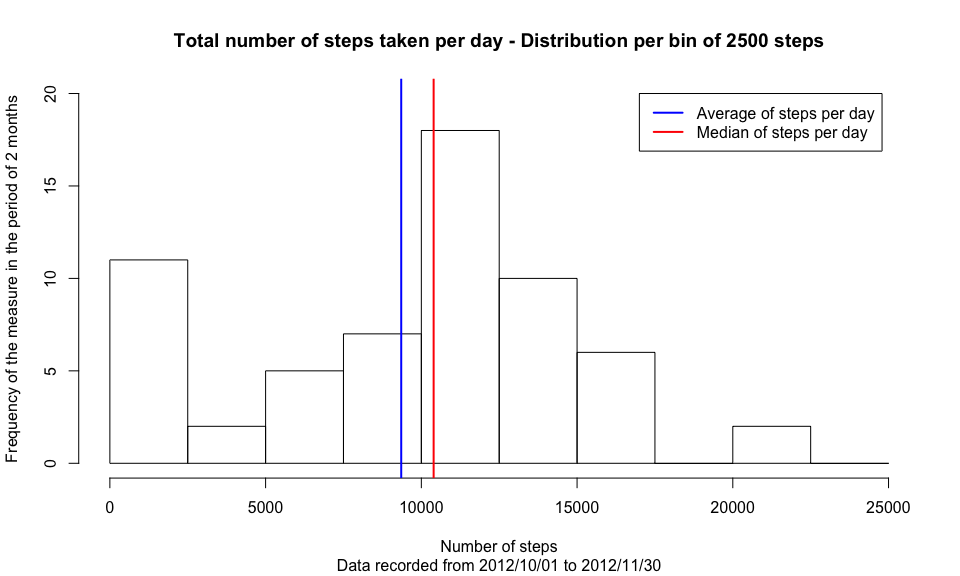
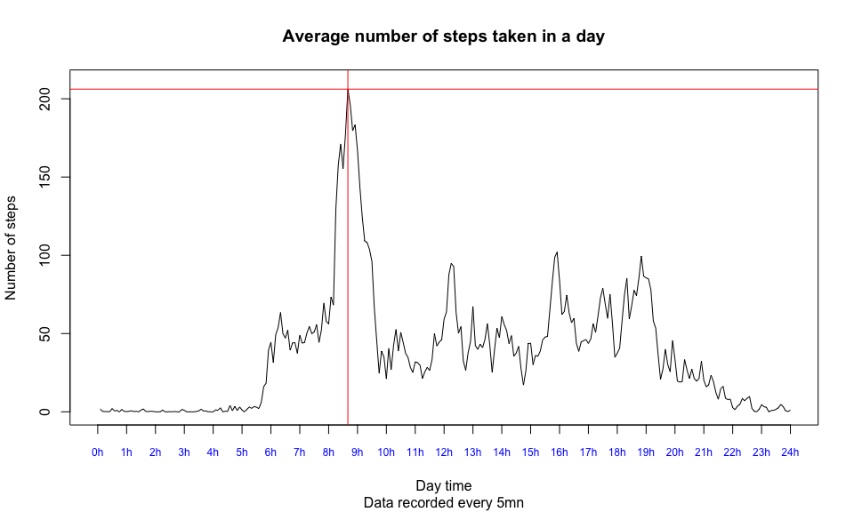
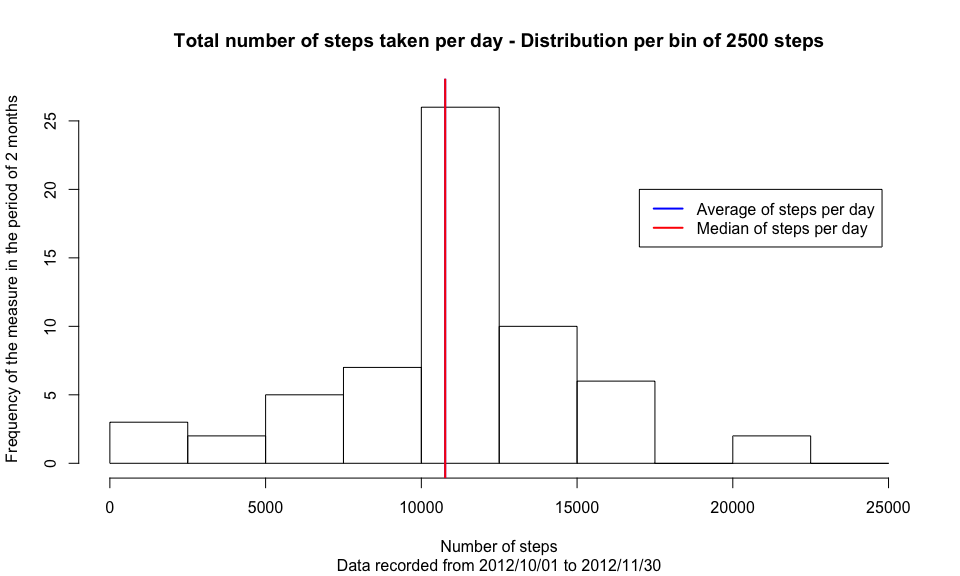
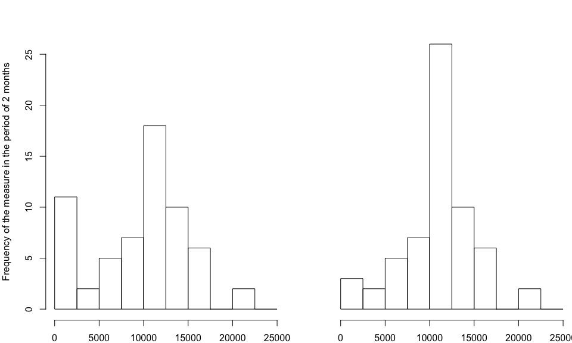
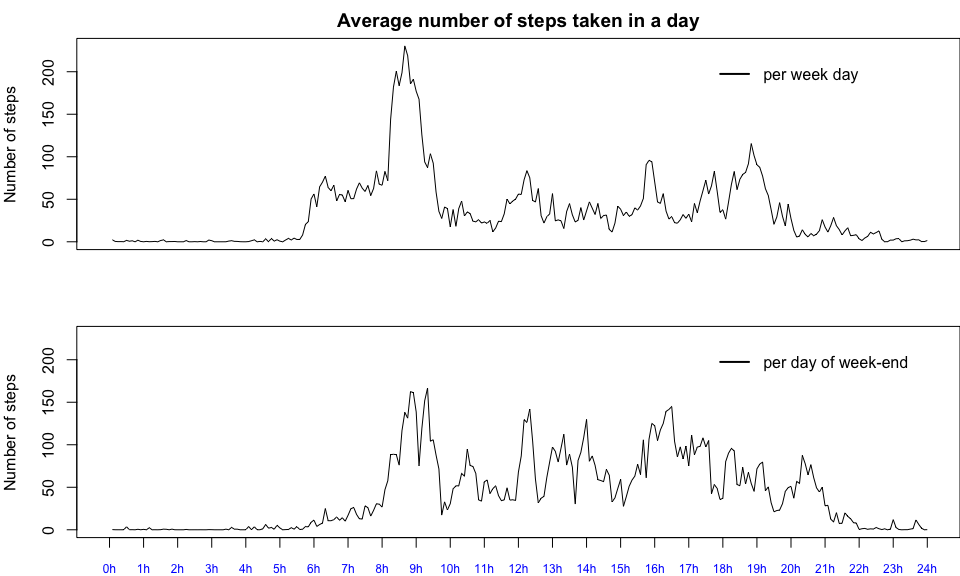

# Reproducible Research: Peer Assessment 1


## 0. Loading useful libraries

```r
library(knitr)
library(dplyr)
library(magrittr)
opts_chunk$set(echo = TRUE)
```

## 1. Loading and preprocessing the data
- Code:  

```r
# 1.1 Load the data and store them into dataframe 'activity'
#     Set the columns classes of the output directly inside the read.csv
#     method
activity <- read.csv(unz('activity.zip', 'activity.csv'),
                     header = TRUE,
                     sep = ',',
                     colClasses=c('integer', 'Date', 'character'))
# 1.2 Process/transform the data (if necessary) into a format suitable for your analysis
# Add time '00:00' to date '2012-10-31' in column activity$date_time
activity$interval <- sapply(activity$interval,
                            FUN = function(x) paste0("0000", x) %>%
                                    substr(nchar(x)+1, nchar(x)+4))
#activity$date_time <- as.POSIXct(paste(activity$date, activity$interval),
#                                 format="%Y-%m-%d %H%M")
dim_activity <- dim(activity)
summary_activity <- summary(activity)
head_activity <- head(activity)
```
- Number of observations/ columns:  

```
## [1] 17568     3
```
- Summary of the data set:  

```
##      steps             date              interval        
##  Min.   :  0.00   Min.   :2012-10-01   Length:17568      
##  1st Qu.:  0.00   1st Qu.:2012-10-16   Class :character  
##  Median :  0.00   Median :2012-10-31   Mode  :character  
##  Mean   : 37.38   Mean   :2012-10-31                     
##  3rd Qu.: 12.00   3rd Qu.:2012-11-15                     
##  Max.   :806.00   Max.   :2012-11-30                     
##  NA's   :2304
```
- Head of the data set:  

```
##   steps       date interval
## 1    NA 2012-10-01     0000
## 2    NA 2012-10-01     0005
## 3    NA 2012-10-01     0010
## 4    NA 2012-10-01     0015
## 5    NA 2012-10-01     0020
## 6    NA 2012-10-01     0025
```

## 2. What is mean total number of steps taken per day?
- Code:  

```r
# NB. For this part of the assignment, we can ignore the missing values in the
# dataset
# 2.1 Calculate the total number of steps taken per day
totalStepsPerDay <- activity %>%
        group_by(date) %>%
        summarise(steps = sum(steps, na.rm = TRUE))
# 2.2 If you do not understand the difference between a histogram and a barplot,
#     research the difference between them. Make a histogram of the total number
#     of steps taken each day
hist(totalStepsPerDay$steps,
     main = 'Total number of steps taken per day - Distribution per bin of 2500 steps',
     sub = 'Data recorded from 2012/10/01 to 2012/11/30',
     xlab = 'Number of steps',
     ylab = 'Frequency of the measure in the period of 2 months',
     breaks = seq(0,25000,2500),
     ylim = c(0,20))
# 2.3 Calculate and report the mean and median of the total number of steps
#     taken per day
meanStepsPerDay <- mean(totalStepsPerDay$steps, na.rm = TRUE)
medianStepsPerDay <- median(totalStepsPerDay$steps, na.rm = TRUE)
abline(v = meanStepsPerDay, col = "blue", lwd = 2)
abline(v = medianStepsPerDay, col = "red", lwd = 2)
legend(17000,
       20,
       legend = c('Average of steps per day','Median of steps per day'),
       lwd = 2,
       col = c('blue','red'))
```

<!-- -->

- Mean of the total number of steps taken per day: <span style="color:blue"><b>9 354,23</b></span>

- Median of the total number of steps taken per day: <span style="color:red"><b>10 395,00</b></span>

## 3. What is the average daily activity pattern?
- Code:  

```r
# 3.1 Make a time series plot (i.e. type = "l") of the 5-minute interval
#     (x-axis) and the average number of steps taken, averaged across all
#     days (y-axis)
averageStepsPerDay <- activity %>%
                        group_by(interval) %>%
                        summarise(steps = mean(steps, na.rm = TRUE))

plot(x = seq(1,nrow(averageStepsPerDay)),
     y = averageStepsPerDay$steps,
     type = 'l',
     main = 'Average number of steps taken in a day',
     sub = 'Data recorded every 5mn',
     xlab = 'Day time',
     xaxt = 'n',
     ylab = 'Number of steps',
     xlim = c(0,length(averageStepsPerDay$interval)),
     ylim = c(0, 210))
axis(1,
     at = seq(0,nrow(averageStepsPerDay), nrow(averageStepsPerDay)/24),
     labels = paste0(seq(0,24,1),'h'),
     col.axis = "blue",
     cex.axis = 0.75)
# 3.2 Which 5-minute interval, on average across all the days in the dataset,
#     contains the maximum number of steps?
max_steps <- max(averageStepsPerDay$steps)
time_max_steps <- averageStepsPerDay[averageStepsPerDay$steps ==
                                             max(averageStepsPerDay$steps), ][,'interval']
abline(v = which(averageStepsPerDay$steps == max_steps), col = "red", lwd = 1)
abline(h = max_steps, col = "red", lwd = 1)
```

<!-- -->

- The maximum number of steps, on average across all the days in the dataset, is: <span style="color:red"><b>206,17</b></span>
- It occurs at <span style="color:red"><b>08:35</b></span>

## 4. Imputing missing values
- Code:  

```r
# NB. Note that there are a number of days/intervals where there are missing values
# (coded as NA). The presence of missing days may introduce bias into some
# calculations or summaries of the data.
# 4.1 Calculate and report the total number of missing values in the dataset
#     (i.e. the total number of rows with NAs)
nb_complete_cases <- complete.cases(activity)
nb_na <- nrow(activity) - sum(nb_complete_cases)
# 4.2 Devise a strategy for filling in all of the missing values in the dataset.
#     The strategy does not need to be sophisticated. For example, you could use
#     the mean/median for that day, or the mean for that 5-minute interval, etc.
# 4.3 Create a new dataset that is equal to the original dataset but with the missing
#     data filled in.
filled_activity <- activity
for (i in 1:length(filled_activity$steps)){
        if (is.na(filled_activity$steps[i] == TRUE)){        
                filled_activity$steps[i] <- averageStepsPerDay$steps[match(filled_activity$interval[i],
                                                                           averageStepsPerDay$interval)]
        }
}
# 4.4 Make a histogram of the total number of steps taken each day, calculate and report
#     the mean and median total number of steps taken per day. Do these values differ from
#     the estimates from the first part of the assignment? What is the impact of imputing
#     missing data on the estimates of the total daily number of steps?
# 4.4.1 Using filled activity data set, calculate the total number of steps taken per day
big_totalStepsPerDay <- filled_activity %>%
        group_by(date) %>%
        summarise(steps = sum(steps, na.rm = TRUE))
# 4.4.2 Using filled activity data set, make a histogram of the total number of steps taken
#       each day
hist(big_totalStepsPerDay$steps,
     main = 'Total number of steps taken per day - Distribution per bin of 2500 steps',
     sub = 'Data recorded from 2012/10/01 to 2012/11/30',
     xlab = 'Number of steps',
     ylab = 'Frequency of the measure in the period of 2 months',
     breaks = seq(0,25000,2500),
     ylim = c(0,27))
# 4.4.3 Using filled activity data set, calculate and report the mean and median of
#       the total number of steps taken per day
big_meanStepsPerDay <- mean(big_totalStepsPerDay$steps, na.rm = TRUE)
big_medianStepsPerDay <- median(big_totalStepsPerDay$steps, na.rm = TRUE)
abline(v = big_meanStepsPerDay, col = "blue", lwd = 2)
abline(v = big_medianStepsPerDay, col = "red", lwd = 2)
legend(17000,
       20,
       legend = c('Average of steps per day','Median of steps per day'),
       lwd = 2,
       col = c('blue','red'))
```

<!-- -->

- Total number of missing values in the dataset: <span style="color:blue"><b>2 304</b></span>

As a strategy for filling in all of the missing values in the dataset, I've chosen to use the mean for the corresponding 5-minute interval on the line containing 'NA'.

- Mean of the total number of steps taken per day for the new dataset without missing value: <span style="color:blue"><b>10 766,19</b></span>

- Median of the total number of steps taken per day for the new dataset without missing value: <span style="color:red"><b>10 766,19</b></span>

<b><i>Do these values differ from the estimates from the first part of the assignment?</i></b>

Yes, the values differ from the first part of the assignment. The mean has increased from <b>9 354,23</b> to <b>10 766,19</b>, ie: a difference of <b>1 411,96</b> more steps in average per day. The median increased from <b>10 395,00</b> to become equal to the mean, ie: <b>10 766,19</b>.  
  
To compare the 2 data sets (with na or not), I suggest to plot the 2 histograms near to each other.


```r
par(mfrow=c(1,2), mar = c(2,4,2,0))
hist(totalStepsPerDay$steps,
     main = NA,
     sub = NA,
     xlab = 'Number of steps',
     ylab = 'Frequency of the measure in the period of 2 months',
     breaks = seq(0,25000,2500),
     ylim = c(0,27))
hist(big_totalStepsPerDay$steps,
     main = NA,
     sub = NA,
     xlab = 'Number of steps',
     ylab = NA,
     yaxt = 'n',
     breaks = seq(0,25000,2500),
     ylim = c(0,27))
```

<!-- -->

<center><p style="font-size:16px"><b>Total number of steps taken per day - Distribution per bin of 2500 steps</b>  
Data recorded from 2012/10/01 to 2012/11/30</p></center>
  
<b><i>What is the impact of imputing missing data on the estimates of the total daily number of steps?</i></b>

In addition to the increase of mean and median, we can say that the distribution of the total daily steps per day is mostly the same. We only notice a swap from the first bin (from 0 to 2500 steps), which was probably counting a few days with lot of missing values, to the bin from 10 000 to 12 500 steps which has significally increased in numbers.

## 5. Are there differences in activity patterns between weekdays and weekends?
- Code:  

```r
# NB. For this part the 'weekdays()' function may be of some help here. Use the
# dataset with the filled-in missing values for this part.
# 5.1 Create a new factor variable in the dataset with two levels – “weekday” and
# “weekend” indicating whether a given date is a weekday or weekend day.
isWeekDays <- function(day) {
        if (weekdays(day) %in% c('Samedi','Dimanche')) return(FALSE)
        else return(TRUE)
}
filled_activity$what_day <- sapply(filled_activity$date,
                                   FUN = function(x)
                                           if (isWeekDays(x[1])) return('weekday')
                                           else return('weekend'))
# 5.2 Make a panel plot containing a time series plot (i.e. type = "l") of the
# 5-minute interval (x-axis) and the average number of steps taken, averaged across
# all weekday days or weekend days (y-axis). See the README file in the GitHub
# repository to see an example of what this plot should look like using simulated data.
averageStepsPerWeekDay <- filled_activity %>%
                        group_by(what_day, interval) %>%
                        summarise(steps = mean(steps))
par(mfrow=c(2,1), mar = c(2,4,2,0))
plot(x = seq(1,nrow(averageStepsPerWeekDay[averageStepsPerWeekDay[, 'what_day'] == 'weekday', ])),
     y = averageStepsPerWeekDay[averageStepsPerWeekDay[, 'what_day'] == 'weekday', ]$steps,
     type = 'l',
     main = 'Average number of steps taken in a day',
     sub = NA,
     xlab = NA,
     xaxt = 'n',
     ylab = 'Number of steps',
     xlim = c(0,length(averageStepsPerWeekDay[averageStepsPerWeekDay[, 'what_day'] == 'weekday', ]$interval)),
     ylim = c(0, 230))
legend(210,
       220,
       legend = 'per week day',
       lwd = 2,
       col = 'black',
       bty = 'n')
plot(x = seq(1,nrow(averageStepsPerWeekDay[averageStepsPerWeekDay[, 'what_day'] == 'weekend', ])),
     y = averageStepsPerWeekDay[averageStepsPerWeekDay[, 'what_day'] == 'weekend', ]$steps,
     type = 'l',
     main = NA,
     sub = 'Data recorded every 5mn',
     xlab = 'Day time',
     xaxt = 'n',
     ylab = 'Number of steps',
     xlim = c(0,length(averageStepsPerWeekDay[averageStepsPerWeekDay[, 'what_day'] == 'weekend', ]$interval)),
     ylim = c(0, 230))
legend(210,
       220,
       legend = 'per day of week-end',
       lwd = 2,
       col = 'black',
       bty = 'n')
axis(1,
     at = seq(0,nrow(averageStepsPerWeekDay[averageStepsPerWeekDay[, 'what_day'] == 'weekday', ]), nrow(averageStepsPerWeekDay[averageStepsPerWeekDay[, 'what_day'] == 'weekday', ])/24),
     labels = paste0(seq(0,24,1),'h'),
     col.axis = "blue",
     cex.axis = 0.75)
```

<!-- -->
